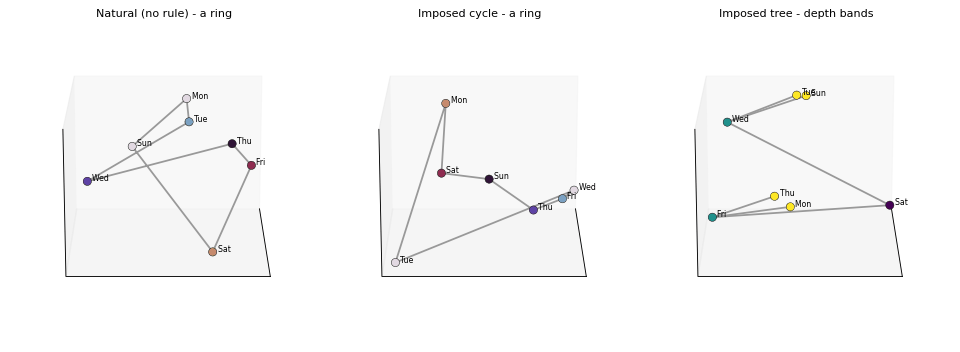

<p align="center">
  
</p>

# Context Is King — reproducibility package

Code and cached data to reproduce *"Context Is King: How In-Context Specification
Shapes the Geometry of Concepts."*

The paper's finding: the relational geometry a language model **uses** over a set
of concepts — down to its topology type (a cycle vs. a tree) — is set by the
in-context specification. It overrides the pretrained prior on conflict, is
causally used (activation patching), and its clean use is gated by scale.

<p align="center">
  
  <br>
  <em>The same seven weekdays, three specifications — a ring, a cycle, and a tree — from the same model, changing only the declared relation (Gemma-4-31B, 3-D PCA of entity centroids).</em>
  <br>
  <b>▶ Rotate it yourself:</b> download <a href="assets/shapes_3d.html"><code>assets/shapes_3d.html</code></a> and open it in a browser (self-contained, no install), or regenerate with <code>python figures/build_interactive_shapes.py</code>.
</p>

### Interactive explorers

Self-contained HTML (open in any browser, no install; regenerate with the script shown):

| explorer | what you can do | file / script |
|---|---|---|
| **Shapes** | rotate the ring / cycle / tree of the same seven weekdays | `assets/shapes_3d.html` · `figures/build_interactive_shapes.py` |
| **Query relocation** | one imposed tree read under many queries (8 shown) — a vector runs from the grand centroid to each query's tree; toggle **Trees / Vectors / Consensus** and **add/remove queries** in the legend, while local structure holds (relocation ≈ 97% of positional variance) | `assets/tree_queries_3d.html` · `figures/build_interactive_tree.py` |
| **Structure from nothing** | 31 meaning-free tokens under a declared hierarchy (asked nothing structural) arrange into depth bands; **depth buttons grow the tree** (2→3→4), nodes labeled with the arbitrary tokens, colored by depth | `assets/arbtree_3d.html` · `figures/build_interactive_arbtree.py` |

## What's here

The package is split into two layers:

- **`figures/`** — CPU-only. Reads cached artifacts from `data/` and redraws
  every paper figure and table. No GPU, no model weights.
- **`extract/`** — GPU. Regenerates the cached artifacts from model weights with
  HuggingFace `transformers`. Only needed if you want to rebuild from scratch.

```
context-is-king/
├── figures/          # LAYER 2 (CPU): cached data -> paper figures & tables
├── extract/          # LAYER 1 (GPU): model weights -> cached data
│   ├── geometry/ behavior/ causal/ shapes/ grid/ orchestrators/
│   └── README.md
├── data/             # cached artifacts (committed; repo is self-contained)
│   └── README.md
├── docs/             # method specs (SPEC_*.md)
├── ARTIFACT_MAP.md   # paper object -> figure script -> data -> extraction script
├── PROVENANCE.md     # which regime each number was measured under (authority)
├── requirements.txt          # figure layer (CPU)
└── requirements-extract.txt  # extraction layer (GPU)
```

## Quickstart — reproduce the figures and tables (no GPU)

```bash
pip install -r requirements.txt

# All cached data is committed, so figures and tables reproduce straight
# from the clone -- no download, no GPU.
cd figures
python make_all.py
# ...or a single figure:
python fig_dominance.py
```

Figure scripts find data via the `CIK_DATA` environment variable, defaulting to
`./data`. Point it elsewhere with `CIK_DATA=/path/to/data python figures/....py`.

See `ARTIFACT_MAP.md` for the exact figure→script→data mapping and `data/README.md`
for what each artifact is.

## Full reproduction — regenerate the cached data (GPU)

See `extract/README.md`. In short: install `requirements-extract.txt` (Gemma-4
loading is `transformers`-version-sensitive — two venvs; details there), point
`$VENV` at the interpreter, and run the orchestrators, e.g.:

```bash
export VENV=/path/to/gpu-venv/bin/python
bash extract/orchestrators/sweep_geom.sh days      # geometry across the model ladder
$VENV extract/causal/causal_use.py google/gemma-4-31B-it --nscr 2
```

Extraction writes into `data/`, matching the layout the figure scripts expect.

## Models

Instruction-tuned `google/gemma-4-{E2B,E4B,12B,31B}-it`,
`Qwen/Qwen3.5-{4B,9B,27B}`, and `meta-llama/Llama-3.1-8B-Instruct` (plus base
variants for the base-model claim).

## Citation

```bibtex
@misc{anon2026contextisking,
  title  = {Context Is King: How In-Context Specification Shapes the Geometry of Concepts},
  author = {Anonymous},
  note   = {Under review},
  year   = {2026}
}
```
